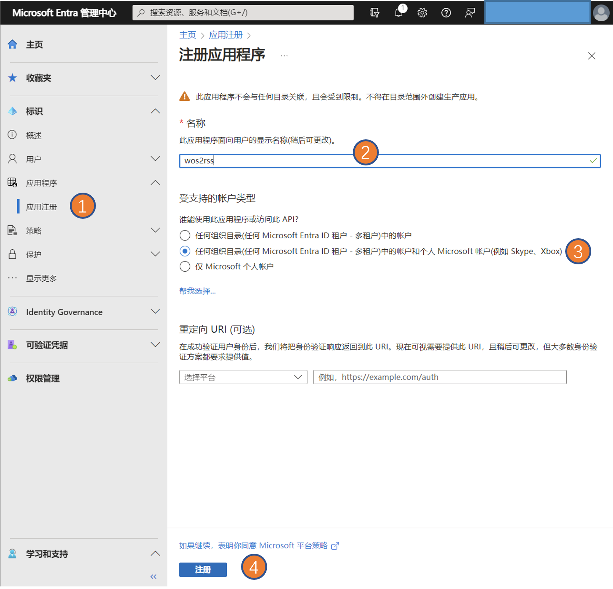
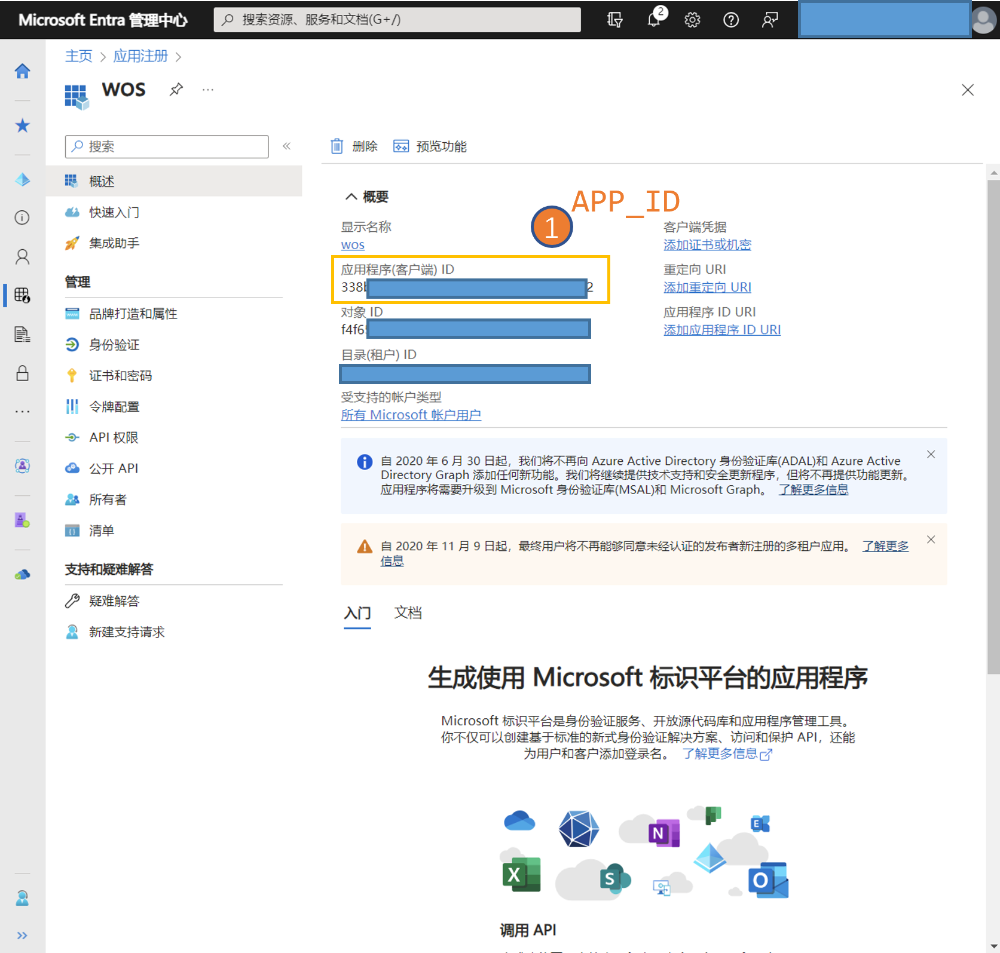
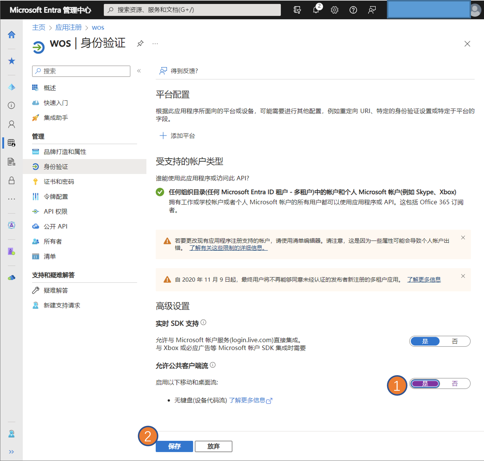
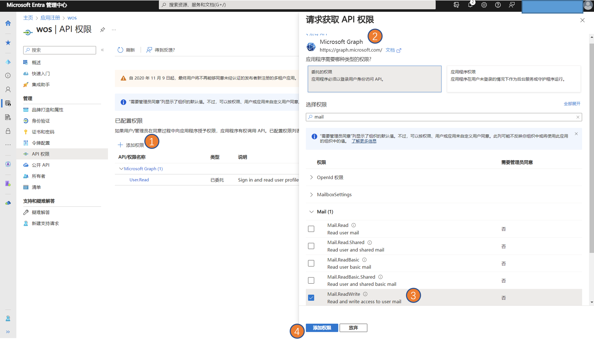

## MS_GRAPH token (Outlook)

注册应用：https://entra.microsoft.com/#home






## Git clone

```shell
git clone https://github.com/osnsyc/Scholar-to-RSS.git
cd Scholar-to-RSS
```

```python
pip install beautifulsoup4 msal
```

## Config 

```ini
# config.ini
[Outlook]
APP_ID = 12345678-1234-1234-1234-1234567890

```

## Mail settings

Set Outlook mail as Alert email in Google Scholar

**or**

Set Outlook mail as Forwarded email in Gmail

## Run

```python
python scholar_to_rss.py
```
Add certificate using Microsoft Graph on first run：https://microsoft.com/devicelogin，type in your user_code

```python
python scholar_server.py
```

## RSS Subscription

`http://YOUR_HOST:9278/scholar.xml`